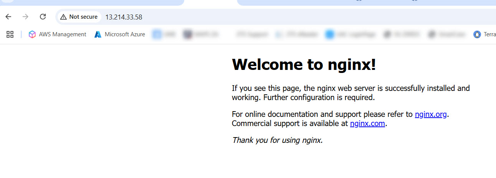

# 🚀 AWS Infrastructure with Terraform — Nginx EC2 Setup

This project provisions an AWS infrastructure using Terraform, including:

- One **VPC** with:
  - Public & private subnets
  - Internet Gateway and routing
- One **EC2 instance** in the public subnet
  - Automatically installs **Nginx** via `user_data`
  - Accessible via public IP / DNS
- **Security Group** allowing HTTP (80) & SSH (22)

## 🧰 Technologies Used

- Terraform v1.x
- AWS EC2, VPC, Subnet, Security Group

## 📁 Project Structure

```
.
├── main.tf
├── variables.tf
├── outputs.tf
├── terraform.tfvars
└── modules/
    ├── ec2/
    └── vpc/
```

## 🚀 Getting Started

```bash
terraform init
terraform apply -auto-approve
```

After apply completes, visit the EC2 instance at:

```
http://<public-ip> or http://<public-dns>
```

## ✅ Example Output

- Public DNS: `ec2-xx-xx-xx-xx.ap-southeast-1.compute.amazonaws.com`
- Nginx welcome page should load

## 📸 Screenshot



## 👨‍💻 Author

[Kumar Abhishek](https://www.linkedin.com/in/kumar-abhishek-55823523/)
